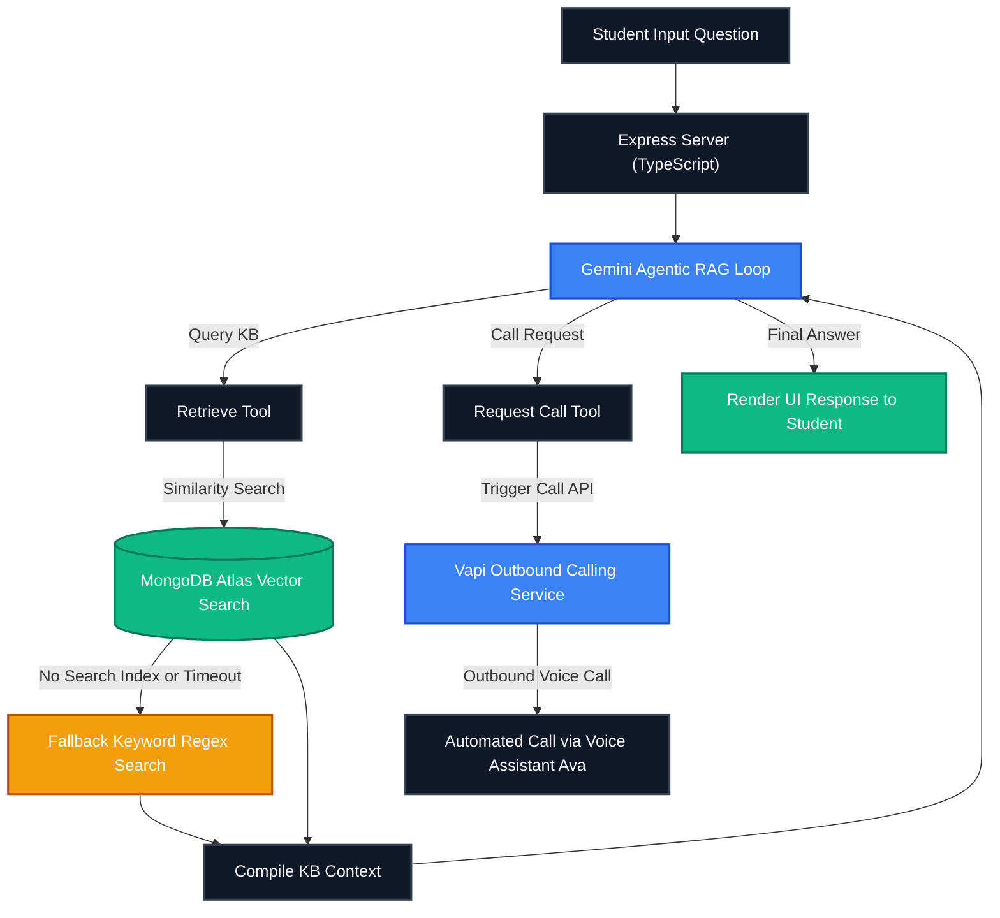

# EduReach College Chatbot

## Overview
This project is an intelligent college counseling system. It helps prospective students learn about EduReach College in Hyderabad and receive immediate voice counseling.

---

## RAG and AI Models Used with Versions

### 1. Conversational Reasoning Model
* **Model**: `gemini-2.5-flash`
* **Library**: LangChain `ChatGoogleGenerativeAI`
* **Configuration**: Temperature `0.0` (for highly deterministic, grounded counseling responses)
* **Role**: Acts as the reasoning agent, orchestrates tool calls, and synthesizes grounded answers.

### 2. Text Embedding Model
* **Model**: `gemini-embedding-001`
* **Dimensions**: 3072 dimensions
* **Role**: Generates high-dimensional vector embeddings for indexing and matching knowledge base text chunks.

### 3. Retrieval Database
* **Database**: MongoDB Atlas Vector Search
* **Index**: `edureach_vector_index`
* **Role**: Stores and performs similarity search on knowledge base embeddings.

---

## Architecture Flowchart Diagram

Here is the visual diagram architecture of our intelligent agentic system. 



---

## Getting Started

### Backend Setup
1. Install node modules:
   ```bash
   npm install
   ```
2. Configure environment variables in `.env`:
   * `GOOGLE_API_KEY`
   * `MONGODB_URI`
   * `VAPI_API_KEY`
   * `VAPI_PHONE_NUMBER_ID`
   * `VAPI_ASSISTANT_ID`
3. Start the server:
   ```bash
   npm run dev
   ```

### Frontend Setup
1. Install node modules:
   ```bash
   npm install
   ```
2. Start the development server:
   ```bash
   npm run dev
   ```
